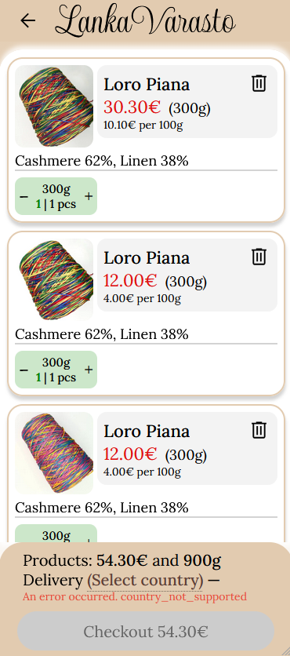

# LankaVarasto 🧶
> A full-stack e-commerce platform for an online yarn store — built end-to-end as a solo project.

**Live site:** [lankavarasto.com](https://lankavarasto.com)

---

## What is this?

LankaVarasto is a production-grade online store built from scratch, including a custom storefront, headless CMS backend, AI-assisted content tooling, and a Telegram-based admin suite for order and inventory management.

This repository serves as the project overview. The codebase is split across three Private repositories:

| Repository | Description |
|------------|-------------|
| [lankavarasto-frontend](https://github.com/dmesp/lanka-varasto-front) | Next.js customer-facing storefront |
| [lankavarasto-backend](https://github.com/dmesp/lanka-varasto-back) | Strapi CMS, REST API, business logic |
| [lankavarasto-bots](https://github.com/dmesp/lanka-varato-bots) | Telegram admin bot for order & inventory management |

---

## Tech Stack

**Frontend:** Next.js 16 (App Router, SSR/ISR), React, TypeScript, Zustand, i18next, Zod, React Hook Form, React Query, styled-components

**Backend:** Strapi 5, PostgreSQL, Node.js

**Infrastructure:** Vercel, Railway, DigitalOcean Spaces

**Integrations:** Paytrail (payments), SendGrid (email), Google Analytics 4, Telegram Bot API & Python

---

## Key Features

- **Optimised storefront** — 90+ Lighthouse score with SSR/ISR, optimised Core Web Vitals, and multi-variant product selection
<table>
  <tr>
    <td align="center"><b>Real Experience by Vercel</b></td>
  </tr>
  <tr>
    <td valign="top"></td>
  </tr>
</table>

- **Real-time stock validation** — prevents overselling and notifies users of inventory changes before checkout
- **Full checkout flow** — personal data handling and automated order confirmation emails via SendGrid
- **AI product descriptions** — integration that generates SEO-optimised product descriptions from tags, reducing manual content work
- **Telegram admin suite** — mobile-friendly bot for real-time order alerts, one-click status updates, tracking number delivery, and product catalog CRUD
- **GDPR-compliant** — cookie consent system, user data access/deletion, analytics only with explicit consent

---

## Architecture Overview

```
Customer Browser
      │
      ▼
  Next.js (Vercel)          ← SSR/ISR pages, cart, checkout UI
      │
      ▼
  Strapi API (Railway)      ← Products, orders, inventory, business logic
      │
      ├── PostgreSQL         ← Primary database
      ├── DigitalOcean Spaces ← Media storage & CDN
      ├── Paytrail           ← Payment processing
      └── SendGrid           ← Transactional emails

Telegram Bot (Railway)      ← Admin interface for order & inventory management
```

---

## Screenshots 


<table>
  <tr>
    <td align="center"><b>Main Page</b></td>
    <td align="center"><b>Product Page</b></td>
    <td align="center"><b>Cart Popup</b></td>
  </tr>
  <tr>
    <td valign="top"></td>
    <td valign="top"></td>
    <td valign="top"></td>
  </tr>
</table>
---

## About

Built by Dima as a solo full-stack project in 2025–2026.