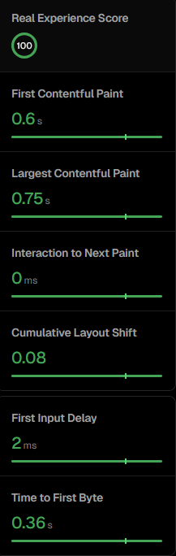
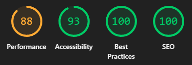
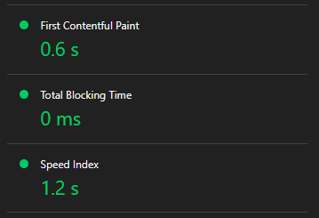
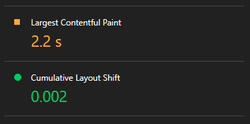
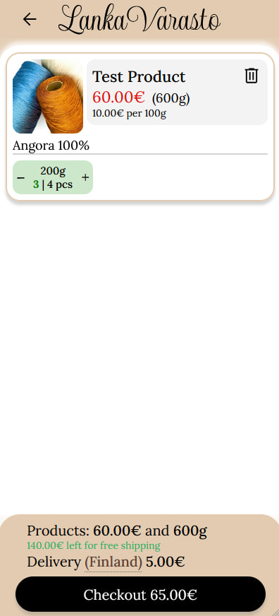
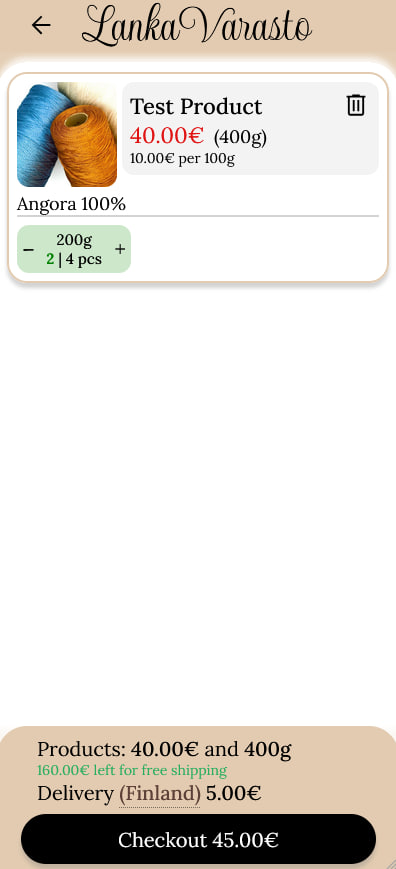
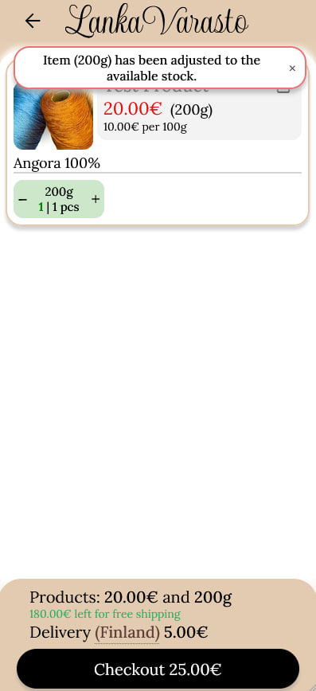
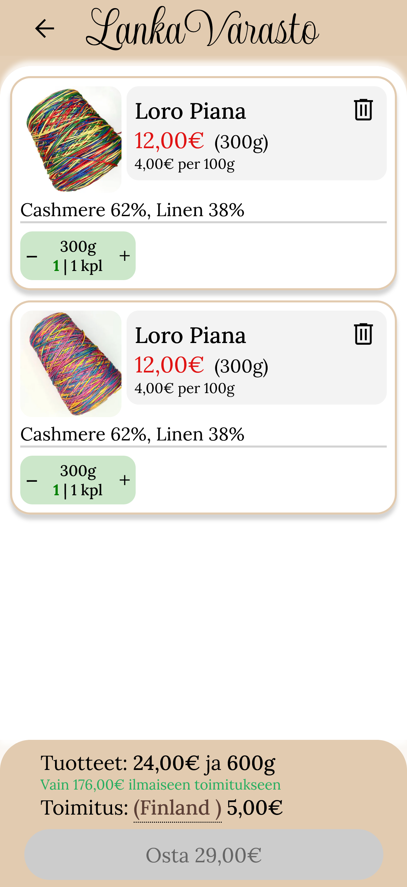
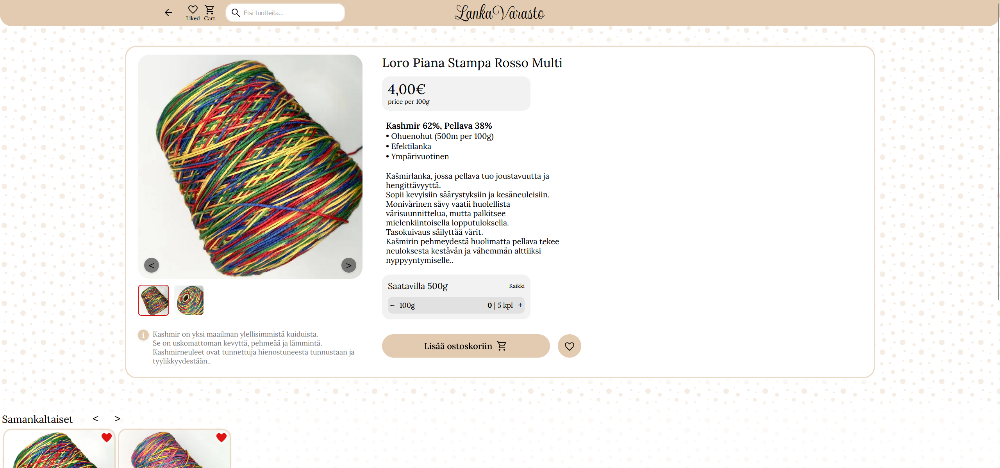

# LankaVarasto 🧶
> A full-stack e-commerce platform for an online yarn store - built end-to-end as a solo project.

**Live site:** [lankavarasto.com](https://lankavarasto.com) (requires access)

---

## What is this?

LankaVarasto is a production-grade online store built from scratch, including a custom storefront, headless CMS backend, AI-assisted content tooling, and a Telegram-based admin suite for order and inventory management.

This repository serves as the project overview. The codebase is split across three Private repositories:

| Repository | Description |
|------------|-------------|
| [lankavarasto-frontend](https://github.com/dmesp/lanka-varasto-front) | Next.js customer-facing storefront |
| [lankavarasto-backend](https://github.com/dmesp/lanka-varasto-back) | Strapi CMS, REST API, business logic |
| [lankavarasto-bots](https://github.com/dmesp/lanka-varato-bots) | Telegram admin bot for order & inventory management |

---

## Tech Stack

**Frontend:** Next.js 16 (App Router, SSR/ISR), React, TypeScript, Zustand, i18next, Zod, React Hook Form, React Query, styled-components

**Backend:** Strapi 5, PostgreSQL, Node.js

**Infrastructure:** Vercel, Railway, DigitalOcean Spaces

**Integrations:** SendGrid (email), Google Analytics 4, Telegram Bot API & Python

---

## Key Features

- **Optimized storefront:** — 90+ Lighthouse and optimized Core Web Vitals.

- **Lean Payloads:** Developed a custom middleware/endpoint to filter out bloated Strapi fields, delivering only essential metadata to the client.

- **Smart Assets:** All product images are served as optimized WebP files (avg. 60-70kB) with fetchPriority and aspect-ratio protection to prevent layout shifts.

- **Mobile-Ready:** Achieves a 100/100 Real Experience Score on high-end mobile devices (Safari/iOS).
<table>
  <tr>
    <td align="center"><b>Real Mobile Experience by Vercel</b></td>
    <td align="center"><b>Lighthouse Score on Desktop</b></td>
  </tr>
  <tr>
    <td valign="top"></td>
    <td width="300" valign="top">
      <div  width="300" style="display: flex; flex-direction: column; align-items:center; gap: 10px;">
        
        
        
      </div>
    </td>
  </tr>
</table>

- **Real-time stock validation** - prevents overselling and notifies users of inventory changes before checkout
<table>
  <tr>
    <td align="center"><b>First tab</b></td>
    <td align="center"><b>Second tab</b></td>
    <td align="center"><b>Second tab</b></td>
  </tr>
  <tr>
    <td align="center" width="230"><b>Selecting 3 of 4 and going to checkout</b></td>
    <td align="center" width="230"><b>Selecting 2 of 4 and going to checkout</b></td>
    <td align="center" width="230"><b>Getting notification because previous user has reservation</b></td>
  </tr>
  <tr>
    <td valign="top">
      
    </td>
    <td valign="top">
      
    </td>
    <td valign="top">
      
    </td>
  </tr>
</table>

- **Oversell-safe reservation system** - custom stock reservation logic handling multi-weight product variants (e.g. the same yarn in 100g, 300g, 500g), ensuring inventory accuracy across concurrent sessions before payment confirmation
- **Full checkout flow** - guest checkout with no account required, Paytrail payment processing, and automated order confirmation emails via SendGrid
- **AI integration** - that reducing manual content work by generating SEO-optimized product descriptions from provided data 
- **Telegram admin suite** - two bots with webhook for real-time order alerts, one-click status updates, tracking number delivery, and product catalog CRUD
- **GDPR-compliant** — cookie consent system, user data access/deletion, analytics only with explicit consent

---

## Architecture Overview

```
Customer Browser
      │
      ▼
  Next.js (Vercel)          ← SSR/ISR pages, cart, checkout UI
      │
      ▼
  Strapi API (Railway)      ← Products, orders, inventory, business logic
      │
      ├── PostgreSQL         ← Primary database
      ├── DigitalOcean Spaces ← Media storage & CDN
      ├── Paytrail           ← Payment processing
      └── SendGrid           ← Transactional emails

Telegram Bot (Railway)      ← Admin interface for order & inventory management
```

---

## Screenshots 


<table>
  <tr>
    <td align="center"><b>Main Page</b></td>
    <td align="center"><b>Product Page</b></td>
    <td align="center"><b>Cart Popup</b></td>
  </tr>
  <tr>
    <td valign="top"></td>
    <td valign="top"></td>
    <td valign="top"></td>
  </tr>
</table>

 <table> <tr>
    <td valign="top"></td>
  </tr></table>
---

## About

Built by Dima as a solo full-stack project in 2025–2026.